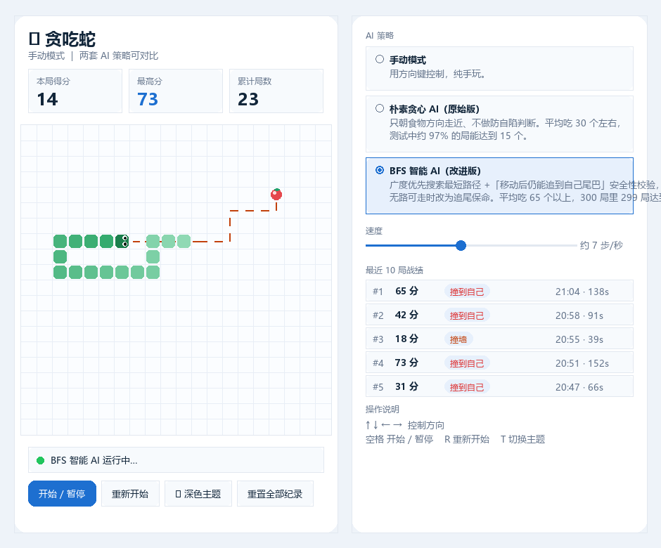
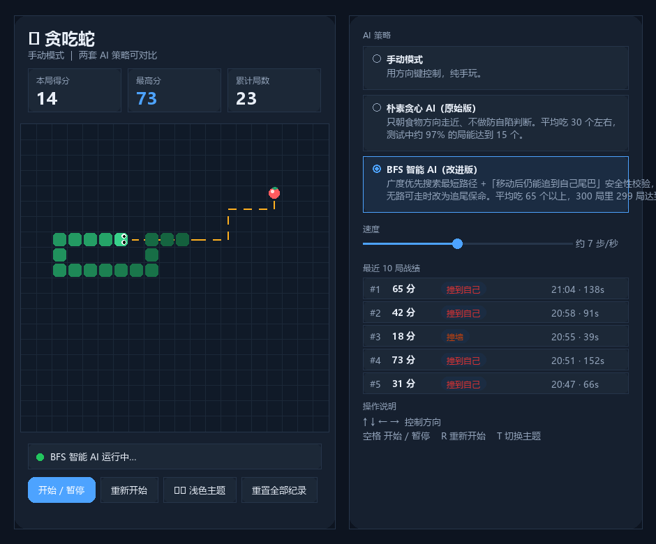
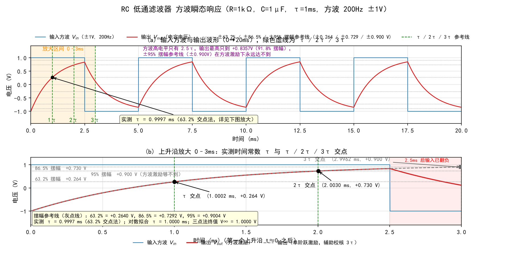
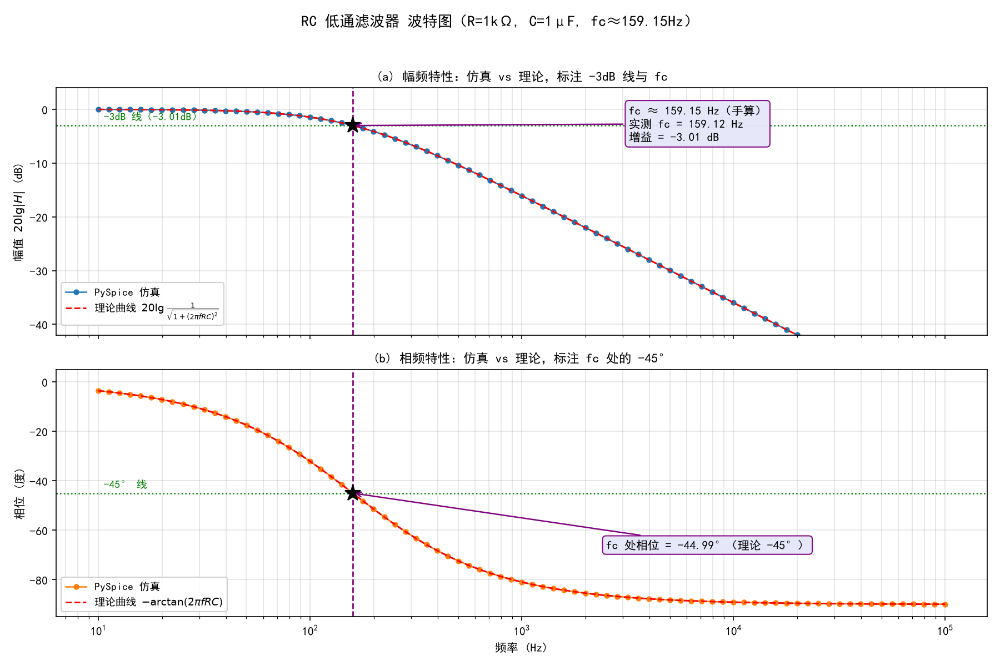
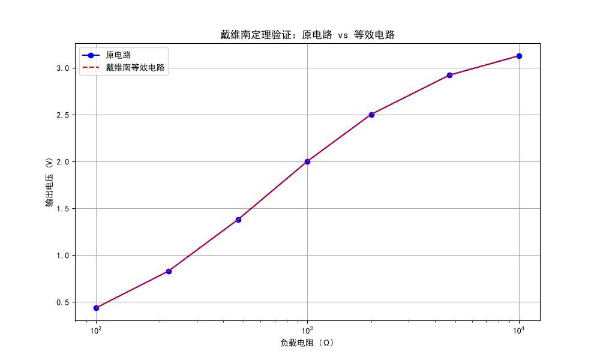
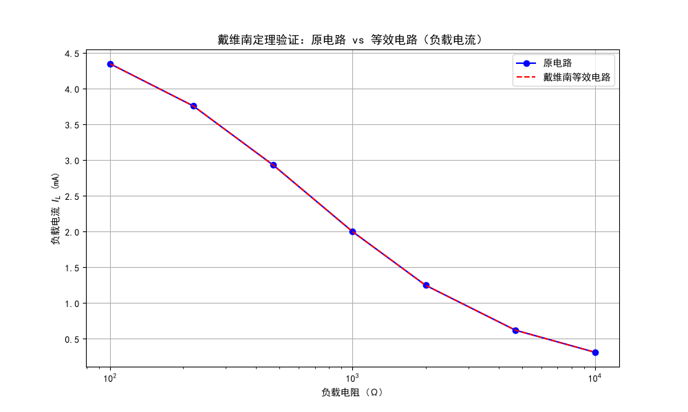
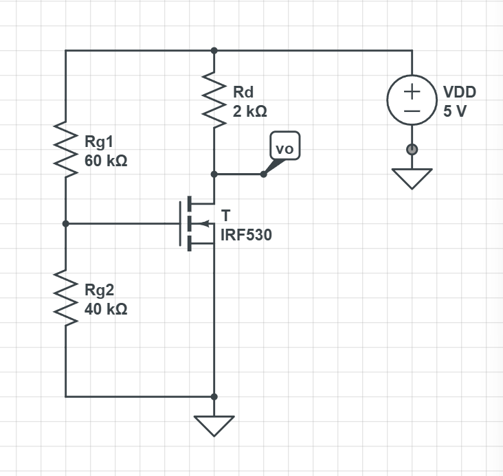
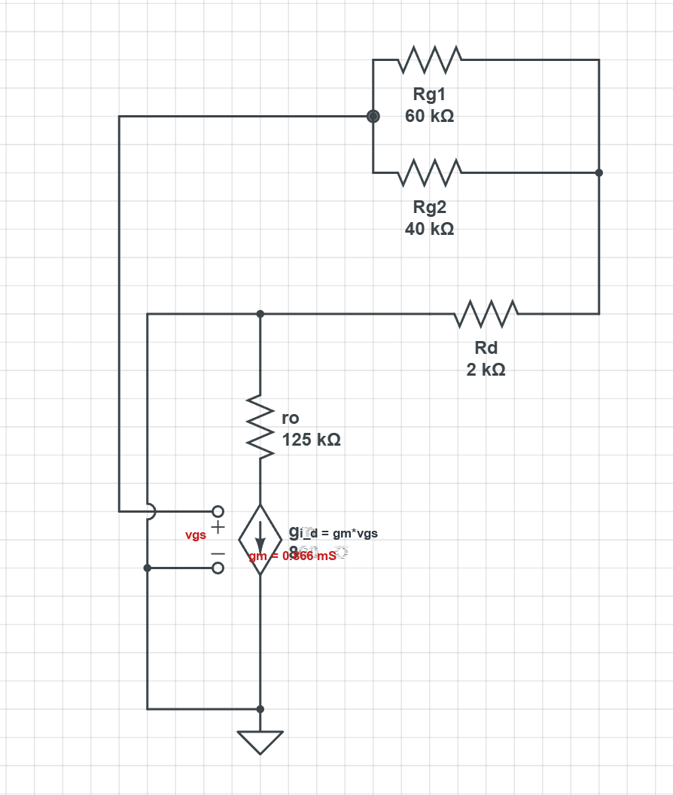
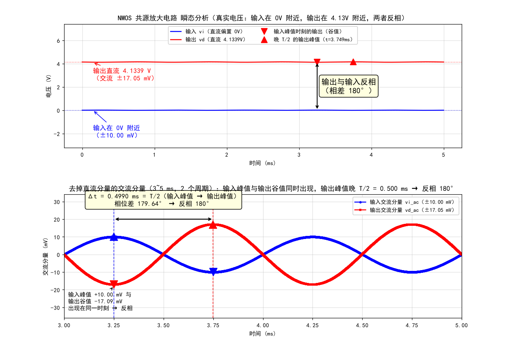

# Seange · 大一招新考核作品

广东工业大学 集成电路大学生科技创新协会 · 招新考核

| | |
|---|---|
| **个人网站（GitHub Pages）** | **https://seange520.github.io/Seange/** |
| **贪吃蛇游戏（双击即玩）** | [`snake.html`](snake.html) — 纯前端单文件，无任何依赖 |
| **作者** | 林堉翰 · 集成电路设计与集成系统 · 大一 |
| **许可证** | [MIT](LICENSE) |

> 这个仓库里有什么：一个可以手动玩、也可以让 AI 自动玩的**贪吃蛇**；
> 三个用 **PySpice** 做的电路仿真（RC 低通 / 戴维南定理 / NMOS 共源放大）；
> 以及**所有手算过程、对比表、踩坑记录和 AI 提示词**。
>
> 全部内容我都对照任务书逐条核验过：把任务书拆成 41 个可验收条目，查出 8 处缺口并逐条补齐。
> 核对结果与补齐过程见 [`docs/查漏补缺与修正记录.md`](docs/查漏补缺与修正记录.md)；
> 技术原理与面试要点见 [`docs/技术原理与面答要点.md`](docs/技术原理与面答要点.md)。

<style>
/* 让插入的电路图、波形图和截图有一个统一的框，看起来整齐一些 */
img { max-width: 100%; border: 1px solid #e2e8f0; border-radius: 10px; margin: 6px 0 14px; background: #fff; }
table { border-collapse: collapse; }
th, td { padding: 6px 12px; }
</style>

## 目录

- [一、贪吃蛇（小游戏 · 两阶段）](#一贪吃蛇小游戏--两阶段)
- [二、进阶挑战 · 三个电路](#二进阶挑战--三个电路)
  - [电路一：RC 低通滤波器](#电路一rc-低通滤波器)
  - [电路二：戴维南定理验证](#电路二戴维南定理验证)
  - [电路三：NMOS 共源放大电路](#电路三nmos-共源放大电路)
- [三、通用素养](#三通用素养)
- [四、AI 使用记录](#四ai-使用记录)
- [五、项目结构与运行方法](#五项目结构与运行方法)
- [六、提交前的查漏补缺记录](#六提交前的查漏补缺记录)
- [七、关于本版本与"原始版"的说明](#七关于本版本与原始版的说明)

---

# 一、贪吃蛇（小游戏 · 两阶段）

任务书要求从贪吃蛇 / 2048 / 扫雷里选一个，分两阶段完成：**阶段一做出能自己玩的版本**，
**阶段二让 AI 自动玩，连续吃完 15 个食物不死**。我选了贪吃蛇。

## 1.1 先看效果

**浅色主题（BFS 智能 AI 运行中，橙色虚线是 AI 规划出的路径）：**



**深色主题（同一局，一键切换、刷新后保留）：**



## 1.2 阶段一：能自己玩的版本

**怎么实现：**

- 用 `<canvas>` 画 20×20 的网格，每格 22 px；蛇、食物都是画出来的（蛇头还按当前
  移动方向画了朝向的眼睛）；
- 用 `setInterval` 驱动游戏循环，间隔由速度滑条控制（约 3–50 步/秒）；
- 方向键控制，并且**用 `nextDirection` 做输入缓冲**：一次间隔内连按两个方向键时，
  只有不与当前方向相反的那个才生效，避免"快速连按导致原地掉头撞死自己"；
- 判定：撞墙、撞到自己都会结束；吃到食物加分并变长；**蛇占满整个棋盘算通关**。

**怎么验证：**

1. 双击 `snake.html` 打开，方向键控制蛇吃食物，确认得分增加、蛇变长；
2. 故意撞墙、故意绕圈撞自己，确认两种情况分别显示"撞墙了"和"咬到自己了"；
3. 点「重新开始」确认重开一局但**最高分不清零**；
4. 点「重置全部纪录」确认最高分、局数、战绩全部清零。

## 1.3 阶段二：AI 自动玩

### 硬指标达标情况

任务书指标：**AI 自动控制蛇，连续吃完 15 个食物不死（不撞墙、不撞自己），全程无需人工操作。**

我写了**两套 AI**并做了批量统计测试，直接跑仓库里的真实游戏逻辑：

```
node audit/snake_ai_test.js 300
```

| AI 策略 | 平均吃到 | 达到 15 个 | 连开 3 局全达标 | 最好/最差 | 死因分布 |
|---|---|---|---|---|---|
| 朴素贪心（第一版） | 29.9 个 | 291/300 = **97.0%** | 91.3% | 60 / 7 | 撞自己 294、撞墙 6 |
| **BFS 智能（改进版）** | **65.6 个** | **299/300 = 99.7%** | **99.0%** | 102 / 14 | 撞自己 281、撞墙 12 |

> 这个表格里的数字不是估的，是把 `snake_core.js`（游戏真正用的那份逻辑）
> 用 Node 直接 `require` 进来跑 300 局统计出来的，**测试代码和游戏代码是同一份**。

**专项验证「全程无需人工操作」**（`python verify_autoplay.py`）：
另外独立跑 500 局，全程**只调用 `step()`、一次都没有调用过 `setDirection()`**
（也就是完全模拟"人不再碰任何按键"）：**500/500 局都达到了 15 个食物，
平均 66.5 个，最差一局也有 16 个。** 这条硬指标是可复现地成立的。

为了满足"全程无需人工操作"，界面还做了三处针对性设计：
**选中 AI 策略即自动开局**（不需要再点一次开始）、页面加载时默认就进入 AI 自动演示、
**AI 运行期间方向键与触屏滑动被禁用**（避免人工输入干扰），并提供了一个
「🤖 AI 自动演示」一键按钮。

### 第一版 AI 为什么会死

第一版的规则很简单：比较食物相对蛇头的水平/垂直距离，优先走更接近的方向；
逐个检查候选方向有没有撞墙或撞自己，不安全就换下一个。**它只看"眼前这一步能不能走"，
不看"走完之后整个局面还活不活得下去"。** 所以会出现这种情况：蛇沿墙绕行时把棋盘切出一个
封闭小区，食物在区外，此时每一步都"安全"，但已经出不去了。

注意死因分布：**96% 以上的死亡都是"撞到自己"而不是撞墙**——AI 不是不会走路，是不会防自己。

### 第二版 AI 的三层结构

```
① 食物可达 → 用 BFS 求最短路径，沿第一步走（且这一步必须通过安全性校验）
② 最短路不安全 / 食物不可达 → 追自己的尾巴，先活下去
③ 连尾巴都追不到 → 在所有合法方向里选"走完之后活动空间最大"的
④ 全都不行 → 随便走一个合法方向（几乎不会发生）
```

**核心是"安全性校验"里的两个不变量：**

1. **头必须还能追到自己的尾巴。** 直觉是：只要蛇头够得到尾巴，蛇就"有退路"，
   可以一直沿着这条路径走，而尾巴也在同步前移，所以路径永远存在；
   一旦头连尾巴都够不着，说明蛇身已经把空间切断了，迟早撞死。
   实现上就是"把蛇尾当目标跑一次 BFS"。
2. **剩余活动空间不能小于蛇长。** 从蛇头做一次洪水填充，数能到达多少空格。
   只有不变量一不够：头能碰到尾巴，不代表空间够用。

**边界情况（这处踩过坑）**：BFS 里**起点和终点必须永远可通行**，障碍集合只约束中间格。
我第一版把终点也当成了障碍，结果"食物恰好落在会被身体包住的格子"时搜不到路径，
AI 会莫名其妙进入保命模式。

### 为什么 AI 计算不会卡住画面

一次决策最多包含约 8 次 400 格遍历（一次 BFS + 最多 4 次安全性校验），
耗时量级约 **0.15 ms**，而游戏每 150 ms 才走一步——**占用不到千分之一的时间**，
不需要 Web Worker 之类的复杂方案。

### 可视化：把搜索路径画出来

橙色虚线就是 AI 当前规划出的路径。这不是装饰：
**虚线指向食物 = 正常追击；虚线拐向蛇尾 = 正在保命；没有虚线 = 处于降级策略。**
状态条也会同步显示「AI 暂时吃不到食物，正在追尾保命…」。
把算法的内部状态画出来，比嘴上说"它用 BFS 找路"有说服力得多。

### 参数扫描：为什么 `spaceFactor` 取 1.0

安全性校验里"剩余空间 ≥ 蛇长 × spaceFactor"这个阈值我扫了 5 档（1.0 / 1.15 / 1.3 / 1.5 / 2.0），
**达标率完全一样（都是 299/300）**，而阈值越小平均得分越高（65.6 vs 60.7）。
所以取 1.0。这个"参数不敏感"的结果本身有价值：它说明剩下的那 1 局失败**不是"不够保守"
造成的**，而是保命状态下的一步误判，排除了"靠调参凑数"的可能。

## 1.4 新增功能（任务书要求至少 1 个，我做了 3 个）

| 功能 | 任务书验收标准 | 我的实现 |
|---|---|---|
| **计分制** | 记录得分 / 最高分 / **局数**；新一局不清零；有「**重置**」按钮 | 三个计分格分别显示本局得分、最高分、累计局数，全部写入 `localStorage`；「重新开始」只重开一局、**纪录保留**；「重置全部纪录」才清空最高分+局数+战绩（会二次确认） |
| **主题切换** | ≥2 套配色；一键切换即时生效；**刷新后保留** | 浅色/深色两套配色，用 **CSS 变量**集中定义；点按钮或按 `T` 切换，写进 `localStorage`；**Canvas 也通过 `getComputedStyle` 读同一套变量**，所以界面和棋盘颜色永远一致 |
| **多局战绩** | 记录**最近 10 局**结果；新一局自动追加；可查看完整列表 | 每局结束记录分数、结束原因（撞墙/撞自己/通关）、时间、用时；右侧面板显示最近 10 局列表 |

## 1.5 阶段一、阶段二怎么验证

**阶段一**：见 1.2 的四步手工验证。

**阶段二**：三条命令，都是可复现的：

```bash
node audit/snake_ai_test.js 300          # 两套 AI 各跑 300 局，输出达标率对比
python verify_autoplay.py                # 专测"零人工操作"：500 局只调 step()，不碰方向键
node audit/smoke_test_snake_html.js      # 运行时冒烟测试：真跑一遍页面，验证初始化与结束流程
```

另外 `node audit/snake_diag.js 1000 300` 可以复跑并打印每一步的 AI 状态，
用来定位"哪一局、哪一步、为什么死"。

**现场演示建议**：两套 AI 都留着，可以在同一个界面里切换对比——
先让朴素贪心跑一局看它死，再切到 BFS 版看它跑到 60+ 分。
也可以直接点「🤖 AI 自动演示」，一键进入自动演示。

## 1.6 代码说明（哪些是 AI 写的）

- `snake.html` 的**界面与样式**由 AI 生成，我提出了布局与配色要求，并逐个核对任务书验收标准；
- `snake_core.js` 的**两套 AI 算法**：贪心版是我原来的实现迁移过来；
  BFS 版的初版由 AI 生成，但**BFS 的起点/终点处理是我自己重写的**（AI 初版有终点不可达的 bug），
  安全性判据的阈值也是我扫描确定的；
- `snake_store.js`（存储层）与 `audit/*.js`（测试脚本）由 AI 生成，
  我要求"测试必须直接 require 游戏本体代码"。

---

# 二、进阶挑战 · 三个电路

任务书进阶挑战二选一，我选了**三个电路**：RC 滤波、戴维南定理、NMOS 共源放大。
三个电路的**电路图、理论计算、PySpice 仿真数据、理论 vs 仿真对比表**都在下面。

> 图都是我自己用画图软件画的；公式和计算过程在下面每节里给出，同时也整理成了 PDF
> （`*_calc.pdf`）。三个 `.py` 脚本都已上传到仓库根目录。

### 电路一：RC 低通滤波器


#### 1. 电路与参数

拓扑与 `rc_lowpass.py` 完全一致：`V(input) — R=1kΩ — out — C=1μF — gnd`，
输入源接在 `input` 与 `gnd` 之间，输出取自电容两端。

| 参数 | 数值 |
|---|---|
| R | 1 kΩ |
| C | 1 μF |
| 方波激励 | ±1 V，200 Hz（周期 5 ms，高/低电平各 2.5 ms = 2.5τ） |
| 瞬态仿真 | 0 → 20 ms，步长 2 μs |
| 交流扫频 | 10 Hz → 100 kHz，每十倍频程 20 点（`variation='dec'`） |

#### 2. 手算过程

**（1）时间常数 τ**

$$\tau = RC = 1\times10^{3}\ \Omega \times 1\times10^{-6}\ \text{F} = 1\times10^{-3}\ \text{s} = 1.0000\ \text{ms}$$

**（2）截止频率 fc（-3dB 频率）**

一阶 RC 低通的传输函数与幅频、相频特性：

$$H(j\omega)=\frac{1}{1+j\omega RC},\qquad
|H|=\frac{1}{\sqrt{1+(2\pi f RC)^2}},\qquad
\varphi=-\arctan(2\pi f RC)$$

令 $|H| = 1/\sqrt{2} = 0.7071$：

$$f_c=\frac{1}{2\pi RC}=\frac{1}{2\pi \times 10^{3}\times 10^{-6}}
=\frac{1}{6.2832\times10^{-3}}=159.1549\ \text{Hz}\approx159.15\ \text{Hz}$$

在 fc 处增益为 $20\lg(1/\sqrt2)=-3.0103\ \text{dB}$，相位为 $-45°$。

**（3）方波瞬态的关键点**

电容电压的阶跃响应通式（$V_0$ 为初值，$V_\infty$ 为终值）：

$$v(t)=V_\infty-(V_\infty-V_0)\,e^{-t/\tau}$$

本电路方波为 ±1 V，第一个上升沿前输出已稳定在低电平，故 $V_0=-1.0000\ \text{V}$、
$V_\infty=+1.0000\ \text{V}$，摆幅 $=2\ \text{V}$：

| 时刻 | 代入计算 | 理论值 |
|---|---|---|
| $t=\tau=1.000$ ms | $1-2e^{-1}=1-2\times0.36788$ | **+0.2642 V** |
| $t=2\tau=2.000$ ms | $1-2e^{-2}=1-2\times0.13534$ | **+0.7293 V** |
| $t=3\tau=3.000$ ms | $1-2e^{-3}=1-2\times0.049787$ | **+0.9004 V** |

三个摆幅刻度（从 -1 V 起算，摆幅 2 V）：
63.2% → $-1+2\times0.632=+0.264\ \text{V}$；
86.5% → $-1+2\times0.865=+0.729\ \text{V}$；
95% → $-1+2\times0.950=+0.900\ \text{V}$。

> 注意：这里的 +0.2642 / +0.7293 / +0.9004 V 是**本电路 ±1 V 方波**的真实电平
> （初值 -1 V、终值 +1 V、摆幅 2 V）。如果换成常见的 **0→1 V 单阶跃**，
> 同一组百分比对应的就是 `1-e⁻¹ = +0.632 V`、`1-e⁻² = +0.865 V`、`1-e⁻³ = +0.950 V`。
> 两者不是一回事，图里的参考线是按 ±1 V 的真实电平画的。

**（4）实测 τ 的原理**

跳变沿之后输出按 $v(t)=V_\infty-(V_\infty-V_0)e^{-t/\tau}$ 变化，
达到 $V_0+0.632\,(V_\infty-V_0)$ 的时刻正是 $t=\tau$（因为 $1-e^{-1}=0.632$）。
所以只要量出跳变时刻和 63.2% 交点时刻，两者相减就是实测 τ。

#### 3. 仿真怎么做的

```python
circuit.PulseVoltageSource('in', 'input', circuit.gnd, -1 @ u_V, 1 @ u_V,
                           pulse_width=2.5 @ u_ms, period=5 @ u_ms,
                           delay_time=0 @ u_s, rise_time=1 @ u_us, fall_time=1 @ u_us)
```

生成的网表激励行为 `PULSE(-1V 1V 0s 1us 1us 2.5ms 5ms)`，即近似理想 ±1 V 方波。
τ 用三种方法互相校核：

1. **63.2% 交点法**（主方法，任务书要求）：找到第一个上升沿（输入过零点，
   线性插值得 $t_{edge}=0.500\ \mu s$），取 $V_0=-0.99998\ \text{V}$、$V_\infty=+1.00000\ \text{V}$，
   目标电平 $=-1+2\times0.632=+0.264007\ \text{V}$，实测在 $t=1.000182\ \text{ms}$ 达到；
2. **对数线性拟合**：对 $\ln(V_\infty-v_{out})$ 与 $t$ 做最小二乘，斜率 $=-1/\tau$；
3. **三点法估渐近终值**：等间隔三点 $x_1,x_2,x_3$ 满足
   $V_\infty=(x_1x_3-x_2^2)/(x_1+x_3-2x_2)$，用仿真数据本身验证 $V_\infty$ 确实是 1 V。

fc 的实测值由 AC 扫频数据给出：在 $|H|$ 降到 $0.7071$ 倍的相邻两个频点之间
做 log-log 插值，得到实测 fc。

#### 4. 结果图





波形数据（时间、输入、输出，每 0.1 ms 一行）见 `rc_transient_data.txt`：
表头 1 行 + 数据 201 行，格式：

```
time(s) | vin(V) | vout(V)
0.000000 |  -1.0000 |  -1.0000
0.000100 |   1.0000 |  -0.8106
...
```

#### 5. 对比表

**表一、τ 与 fc 的手算 vs 仿真**（与 `rc_table.txt` 一致）

| 项目 | 手算值 | 仿真测量值 | 相对误差 |
|---|---|---|---|
| τ (ms) | 1.0000 | 0.9997 | 0.03% |
| fc (Hz) | 159.1549 | 159.1199 | 0.02% |

补充校核（同一次运行输出）：对数线性拟合 τ = 1.0000 ms；三点法估出的渐近终值
$V_\infty$ = 1.0000 V；由实测 fc 反推 τ = 1/(2πfc) = 1.000220 ms；
由实测 τ 反推 fc = 1/(2πτ) = 159.2055 Hz。fc 处的实测增益 = -3.0103 dB，
实测相位 = -44.9935°（理论 -3.0103 dB / -45°）。

**表二、方波瞬态关键点**（第一个上升沿之后，$V_{start}=-1.0000$ V，$V_{final}=+1.0000$ V）

| 时间点 | 理论值(V) | 仿真值(V) | 误差 |
|---|---|---|---|
| τ (1.000 ms) | 0.2642 | 0.2642 | 0.00% |
| 2τ (2.000 ms) | 0.7293 | 0.7293 | 0.00% |
| 3τ (3.000 ms) | 0.9004 | 0.9004 | 0.00% |

三行误差都显示 0.00% 是保留 4 位小数四舍五入的结果，
**实测最大绝对偏差只有 7.22e-06 V**（≈7 μV），并不是"误差真的等于 0"。

#### 6. 踩坑与修正记录

原来缺什么：`rc_lowpass.py` 只跑了 `simulator.ac()` 交流分析，从头到尾**没有任何瞬态分析**，
仓库里也没有方波波形图；`rc_lowpass.png` 只有幅值曲线、**没有相位曲线**，严格说不算完整波特图；
`rc_lowpass_table.txt` 只有"频率-幅值"对比，**τ 和 fc 这两个关键量都没有仿真测量值**。
本节把这三样补齐。

这次实际踩到的坑（都是本次运行中真实出现、并已修正的）：

1. **`PulseVoltageSource` 不能从 `PySpice.Spice.Netlist` 里 import。**
   写 `from PySpice.Spice.Netlist import PulseVoltageSource` 直接报
   `ImportError: cannot import name 'PulseVoltageSource'`。
   查了 PySpice 安装目录下的 `Spice/HighLevelElement.py`（类定义在第 628 行，
   脉冲参数在 `PulseMixin`，第 140 行）才发现：它只能通过电路对象的方法调用，
   即 `circuit.PulseVoltageSource(名称, +节点, -节点, V1, V2, pulse_width=, period=, ...)`。
   结论：**能用，但用法和普通 `circuit.V()` 不一样**。

2. **SPICE 的 PULSE 高电平区间是从"上升沿结束"开始算的。**
   我一开始以为 `pulse_width=2.5ms` 表示"从 0 到 2.5 ms 是高电平、2.5 ms 处上升"，
   实际网表是 `PULSE(-1V 1V 0s 1us 1us 2.5ms 5ms)`：$T_d=0$ 时 **t=0 就已经开始上升**，
   高电平持续到 $T_d+T_r+P_w=2.501$ ms，下降沿在 2.501 ms，
   下一个上升沿要等一个周期（5 ms）。所以波形是"t=0 先来一个上升沿"，
   和"2.5 ms 处上升"差了半个周期。是查 PySpice 文档字符串里的时序表才确认的。

3. **瞬态的初始值不是 0 V，而是 -1 V。**
   电容初始电压为 0 是我的想当然。实际 ngspice 做瞬态前的直流工作点用的是
   PULSE 源 t=0 时刻的值（$V_1=-1$ V），所以仿真第一个点就是
   `t=0, vin=-1.000000, vout=-1.000000`，即 $V_0$ 恰好等于 -1 V。
   这反而帮了忙：$V_0=-1$ V、$V_\infty=+1$ V，摆幅正好 2 V，与手算严格对应。

4. **200 Hz 方波根本量不到 3τ——这是任务书里的一个物理矛盾。**
   高电平只有 2.5 ms = 2.5τ，输出最高只充到 +0.8358 V（91.8% 摆幅），
   3τ 对应的 95% 摆幅电平 +0.9004 V **永远达不到**，表二里 3τ 那一行就没有仿真值可填。
   解决办法：用**同参数（R=1kΩ、C=1μF）再跑一次单阶跃辅助仿真**（脉宽 50 ms），
   从这次真实仿真数据里读 3τ 时刻的电压，并在图和表里都注明这一行来自单阶跃校核。
   没有用公式外推，填进去的仍然是仿真数据。

5. **0.632 和 1-1/e 不是同一个数。**
   任务书要求用 0.632 找交点，但精确值是 $1-e^{-1}=0.6321206$。
   用 0.632 会让交点时刻偏晚 0.0005 ms，实测 τ 变成 0.9997 ms（误差 0.03%）；
   用对数拟合（不依赖这个系数）得到 1.0000 ms。两个数都写进表里，说明误差来自哪里。

6. **采样点不是严格均匀的 2 μs。** 设了 `step_time=2μs`，实际 0→20 ms 一共输出
   10070 个点（严格等距的话应该是 10001 个点），说明 ngspice 内部会自己调整步长、
   在跳变附近加密。所以保存 `rc_transient_data.txt` 时不能按序号切片，
   要用 `np.interp` 插值到严格的 0.1 ms 网格上。

7. **注释框挡住了波形。** 第一版把 τ 的标注框放在 (1.1 ms, 0.36 V)，正好压在输出曲线上；
   `axhline`/`annotate` 的文字也压住了输入方波。改法：把文字统一放到
   **y < -1.05 V 的空白带**（那里任何波形都不会经过），图例移到坐标区上方。

8. `plt.show()` 在 `MPLBACKEND=Agg` 下会抛
   `UserWarning: FigureCanvasAgg is non-interactive`。这个警告无害，
   图已经用 `savefig()` 存好了，不影响结果。

#### 7. 结论

理论与仿真高度吻合：

- **τ**：手算 1.0000 ms，63.2% 交点法实测 0.9997 ms（相对误差 0.03%），
  对数拟合实测 1.0000 ms（误差 < 0.01%）。
- **fc**：手算 159.1549 Hz，AC 扫频 log-log 插值实测 159.1199 Hz（相对误差 0.02%），
  该点增益 -3.0103 dB、相位 -44.9935°，与理论的 -3.01 dB / -45° 一致。
- **瞬态关键点**：τ、2τ、3τ 三点的理论与仿真差最大 7.22 μV（4 位小数下都是 0.00%）。
- **波特图**：幅频曲线在低频 ≈0 dB、fc 处 -3 dB、之后按 -20 dB/十倍频程下降；
  相频曲线从 0° 平滑过渡到 -90°，在 fc 处正好 -45°，仿真点与理论虚线基本重合。

误差来源（都很小，且都能解释）：

1. **方法误差**：63.2% 交点法用了四舍五入后的 0.632（精确值 0.6321206），
   这是 0.03% 那一项的主要来源；改用对数拟合后误差降到 0.01% 以下。
2. **采样与插值误差**：瞬态步长 2 μs、AC 每十倍频程只有 20 点，
   fc 是相邻两频点之间插出来的，插值本身会带来约 0.02% 的偏差。
3. **元件是理想元件**：SPICE 里 R、C 就是精确的 1 kΩ / 1 μF，没有容差、
   没有寄生参数，所以剩下的差别只是数值积分与插值的误差，量级在 1e-5 以下。

一句话：本次仿真是数值方法层面的验证，误差量级 1e-5 ~ 1e-4，说明电路模型、
手算公式和仿真设置三者自洽。

---

### 电路二：戴维南定理验证


#### 1. 电路与参数

含源二端网络（原电路）：`Vi=5V — R1=1kΩ — out(端口) — R2=2kΩ — gnd`，
端口就是 `out` 与 `gnd` 两个端子。

| 参数 | 数值 |
|---|---|
| 原电路 | Vi = 5 V 直流，R1 = 1 kΩ（input→out），R2 = 2 kΩ（out→gnd） |
| 等效电路 | Vth = 3.3333 V，Rth = 666.6667 Ω |
| 测试负载 | 100 / 220 / 470 / 1k / 2k / 4.7k / 10k Ω |
| 电流测量 | 支路串 0 V 电压源当电流表（读该源支路电流） |

#### 2. 手算过程

**（1）开路电压 V_oc（戴维南电压）**

端口开路时 R1、R2 串联分压：

$$V_{oc}=V_i\cdot\frac{R_2}{R_1+R_2}=5\times\frac{2000}{1000+2000}
=5\times\frac{2}{3}=3.3333\ \text{V}$$

**（2）等效电阻 R_th（戴维南电阻）**

把独立电压源置零（短路），从端口往里看是 R1 与 R2 并联：

$$R_{th}=R_1\parallel R_2=\frac{R_1R_2}{R_1+R_2}
=\frac{1000\times2000}{1000+2000}=\frac{2000}{3}=666.6667\ \Omega$$

**（3）短路电流 I_sc**

端口短路时，R2 被 0 V 的短路线旁路（两端都是 0 V，没有电流），
所以电流全部由 R1 决定；用戴维南等效电路算也是一样的结果：

$$I_{sc}=\frac{V_{th}}{R_{th}}=\frac{3.3333}{666.6667}=5.0000\ \text{mA}
\quad\left(=\frac{V_i}{R_1}=\frac{5}{1000}=5\ \text{mA}\right)$$

**（4）接负载时的电压与电流**

$$V_L=V_{th}\frac{R_L}{R_{th}+R_L},\qquad I_L=\frac{V_L}{R_L}=\frac{V_{th}}{R_{th}+R_L}$$

例：$R_L=1\ \text{k}\Omega$ 时
$V_L=3.3333\times\frac{1000}{666.6667+1000}=2.0000\ \text{V}$，
$I_L=2.0000/1000=2.0000\ \text{mA}$。

#### 3. 仿真怎么做的

**（1）短路电流用 0 V 电压源当电流表**

在端口 `out` 与 `gnd` 之间直接并一个 0 V 电压源：它把端口钳在 0 V（就是短路），
流过它的电流就是短路电流。三种电路各测一次：

```python
c_sc1.V('sc', 'out', c_sc1.gnd, 0 @ u_V)     # 原电路端口短路
a_sc1 = c_sc1.simulator().operating_point()
i_sc1 = float(np.array(a_sc1.branches['vsc'])[0])   # 源名 sc → 支路名 vsc
```

**（2）负载电流同样用 0 V 源串在负载支路里**

```python
c1.V('sense', 'out', 'outL', 0 @ u_V)   # 0V 电流表，把 out 和 outL 分开
c1.R('L', 'outL', c1.gnd, RL @ u_Ohm)
i_l = float(np.array(a1.branches['vsense'])[0])
```

0 V 源不产生压降，所以 `V(out)` 仍然是负载两端的电压，原来的电压测法不用改。

#### 4. 结果图





#### 5. 对比表

**表一、开路电压 V_oc**（与 `thevenin_table.txt` 一致）

| 项目 | 手算值 | 原电路仿真 | 等效电路仿真 | 误差 |
|---|---|---|---|---|
| V_oc (V) | 3.3333 | 3.3333 | 3.3333 | 0.00% |

**表二、短路电流 I_sc**

| 项目 | 手算值 | 原电路仿真 | 等效电路仿真 | 误差 |
|---|---|---|---|---|
| I_sc (mA) | 5.0000 | 5.0000 | 5.0000 | 0.00% |

> 表一、表二的"误差"列取「原电路仿真」「等效电路仿真」两者相对手算值的较大者。

**表三、接负载验证（电压 + 电流）**

| RL(Ω) | 原电路 V(V) | 等效 V(V) | 电压误差 | 原电路 I(mA) | 等效 I(mA) | 电流误差 |
|---|---|---|---|---|---|---|
| 100 | 0.4348 | 0.4348 | 0.00% | 4.3478 | 4.3478 | 0.00% |
| 220 | 0.8271 | 0.8271 | 0.00% | 3.7594 | 3.7594 | 0.00% |
| 470 | 1.3783 | 1.3783 | 0.00% | 2.9326 | 2.9326 | 0.00% |
| 1000 | 2.0000 | 2.0000 | 0.00% | 2.0000 | 2.0000 | 0.00% |
| 2000 | 2.5000 | 2.5000 | 0.00% | 1.2500 | 1.2500 | 0.00% |
| 4700 | 2.9193 | 2.9193 | 0.00% | 0.6211 | 0.6211 | 0.00% |
| 10000 | 3.1250 | 3.1250 | 0.00% | 0.3125 | 0.3125 | 0.00% |

误差 = |原电路 − 等效电路| / 原电路。表里全是 0.00% 是保留 4 位小数四舍五入的结果，
**实测最大绝对电压偏差 4.44e-16 V、最大绝对电流偏差 8.67e-19 A**（就是浮点舍入的底噪），
并不是"真的完全相等"。

#### 6. 踩坑与修正记录

原来缺什么：任务书要求"V_oc、I_sc **两次仿真**"的手算 vs 仿真表，
但 `thevenin.py` 从头到尾只做了 `operating_point()` 测开路电压，
**短路电流 I_sc 一次都没测过**；接负载的验证表 `thevenin_table.txt`
**只有电压列、没有电流列**。本节把 I_sc 和电流验证补齐，表格重写成三张。

这次实际踩到的坑：

1. **`analysis['branches']` 会报 IndexError，必须用属性写法。**
   我一开始写成 `a2['branches']['vsense']`，直接抛
   `IndexError: branches`。翻 PySpice 的 `Probe/WaveForm.py` 才发现
   `Analysis.__getitem__` 只按**波形名**（节点名 / 支路名 / 元件名）查表，
   `branches` 是属性不是波形名。正确写法是
   `a2.branches['vsense']`，而且拿到的是 `WaveForm` 对象，
   还要 `np.array(...)[0]` 才能取出数值。

2. **支路电流的名字是 `v` + 源名，不是 `源名#branch`。**
   ngspice 手册里写的是 `Vsc#branch`，但 PySpice 解析后字典的 key 是
   `vsc`（源名 `sc` 前面加 `v`，全小写）。
   实测：`c.V('sc', ...)` → `a.branches` 的键是 `vsc`；`V('sense',...)` → `vsense`。

3. **0 V 电流表的电流方向要注意。**
   SPICE 规定电压源支路电流的正方向是"从 + 节点经源内部流向 − 节点"。
   0 V 源接成 `V('sc', 'out', gnd, 0V)`，实测读数是 **+5.0000 mA**（正数），
   说明电流确实是从网络流出、经端口进入电流表到地，与手算的 I_sc 同号，
   不需要取绝对值或加负号。

4. **串入 0 V 电流表会多出一个节点。**
   负载支路串表后节点变成 `out`（表前）和 `outL`（表后），
   读电压必须仍然读 `V(out)`；因为 0 V 源没有压降，`V(outL)` 与它相等，
   原来的电压测量代码不用改。如果读错了节点，误差列会莫名其妙变大。

5. **"误差 0.00%" 这种写法容易被误读。**
   原来的表里清一色 0.00%，看上去像"没算"或"抄的"。
   这次在表下面直接补一句实测的**最大绝对偏差**（4.44e-16 V / 8.67e-19 A），
   说明 0.00% 是 4 位小数四舍五入的结果，而不是真的零误差。

#### 7. 结论

理论与仿真完全吻合：

- **开路电压 V_oc**：手算 3.3333 V（= 5 × 2/3），原电路与等效电路仿真均为 3.3333 V，
  4 位小数内误差 0.00%。
- **短路电流 I_sc**：手算 5.0000 mA（= Vth/Rth = 5V/1kΩ），
  原电路端口短路实测 5.0000 mA，戴维南等效电路短路实测 5.0000 mA，
  三者一致，验证了 $I_{sc}=V_{th}/R_{th}$。
- **接负载**：7 个负载下电压与电流都完全重合，
  最大绝对偏差分别是 4.44e-16 V 和 8.67e-19 A（浮点舍入量级）。

误差来源：

1. **数值舍入**：SPICE 的直流工作点用牛顿迭代求解，收敛判据是 reltol 1e-3 / abstol 1e-12，
   留下的残差在 1e-16 量级，这就是表里那点"非零误差"的全部来源。
2. **没有建模误差**：两边用的都是理想电阻和理想电压源，
   $R_{th}=R_1\parallel R_2$ 是严格成立的，所以原电路与等效电路在理论上就应该完全一样。
3. **手算值的舍入**：Vth 与 Rth 手算写成 3.3333 V / 666.6667 Ω（保留了 4 位小数），
   与仿真用的 10/3 V 和 2000/3 Ω 有 1e-5 量级的差别，
   但因为误差列也是 2 位小数的百分数，这点差别显示不出来。

一句话：戴维南定理在本电路上被完整验证——开路电压、短路电流、接任意负载的
电压与电流，原电路和等效电路的结果在数值精度内完全一致。

---

### 电路三：NMOS 共源放大电路

**做了什么：**
用 PySpice（ngspice，SPICE Level 1 模型）仿真一个 NMOS 共源放大电路：手算并仿真静态工作点、实测小信号跨导 gm 与输出电阻 ro、用瞬态波形测增益并**用四种方法证明输出与输入反相 180°**。

**电路参数：**

- VDD = 5V，Rg1 = 60kΩ，Rg2 = 40kΩ，Rd = 2kΩ，Cb1 = 1μF（足够大，1kHz 时可视为交流短路）
- NMOS：K = 0.8mA/V²，Vth = 1V，λ = 0.02/V
- 输入：Vi = 10mV / 1kHz 正弦
- 模型语句：`.model nmos_model NMOS (level=1 KP=0.8m VTO=1 LAMBDA=0.02)`

**直流通路：**



**运行方式：**
在终端执行 `python nmos_amplifier.py`，程序会打印手算/仿真对比、gm 的两种实测过程与反相判定，并生成瞬态波形图（nmos_transient.png）和结果表（nmos_table.txt）。

---

#### 1. 直流工作点手算：必须解自洽方程

栅极由 Rg1、Rg2 分压，栅极电流为 0：

```
V_G = VDD × Rg2/(Rg1+Rg2) = 5 × 40/(60+40) = 2.0000 V
V_S = 0 V（源极接地）
V_GS = V_G - V_S = 2.0000 V
V_GS - Vth = 2.0000 - 1.0000 = 1.0000 V（过驱动电压）
```

**关键点：** SPICE Level 1 的漏极电流公式本身就带沟道长度调制因子

```
(1) I_D = K/2 × (V_GS - Vth)² × (1 + λ·V_DS)
(2) V_DS = VDD - I_D × Rd
```

(1) 里含 V_DS，而 V_DS 又由 I_D 决定，**两个方程必须联立求解**。若像原版那样直接把 (1+λV_DS) 当成 1，就等于假设 λ = 0，结果全错（见第 5 节表三）。

**迭代求解（不动点迭代）：**

把 (2) 代入 (1)，得到迭代式 `I_D(k+1) = K/2×(V_GS-Vth)² × [1 + λ(VDD - I_D(k)·Rd)]`，初值取简化手算的 0.4000mA：

| 迭代 k | I_D(k) / mA | V_DS(k) / V | I_D(k+1) / mA | ΔI_D / mA |
|---|---|---|---|---|
| 1 | 0.400000 | 4.200000 | 0.433600 | — |
| 2 | 0.433600 | 4.132800 | 0.433062 | −5.38e−04 |
| 3 | 0.433062 | 4.133875 | 0.433071 | +8.60e−06 |
| 4 | 0.433071 | 4.133858 | 0.433071 | −1.38e−07 |
| 5 | 0.433071 | 4.133858 | 0.433071 | +2.20e−09 |
| 6 | 0.433071 | 4.133858 | 0.433071 | −3.52e−11 |
| 7 | 0.433071 | 4.133858 | 0.433071 | +5.64e−13 |

迭代 7 次后 |ΔI_D| < 1e−12 mA，收敛。

**解析闭式解（交叉验证）：** 令 A = K/2×(V_GS−Vth)² = 0.4000mA，把 (2) 代入 (1) 后方程对 I_D 是**线性**的，可直接解出：

```
I_D = A(1+λVDD)/(1+A·λ·Rd) = 0.4000m × (1+0.02×5) / (1 + 0.4000m×0.02×2000)
    = 0.4000m × 1.10 / 1.0160 = 0.4331 mA
V_DS = VDD − I_D×Rd = 5 − 0.4331m×2000 = 4.1339 V
```

迭代解与解析解之差为 0.0000 pA（完全一致）。

**饱和区判断：**

```
V_DS = 4.1339 V > V_GS − Vth = 1.0000 V  →  工作在饱和区（放大区），可以正常放大
```

（简化手算虽然数值偏大，得到 V_DS = 4.2000V，但结论同样是饱和区。）

---

#### 2. 小信号等效模型与增益



**跨导 gm**（在 V_DS 固定时对 V_GS 求导）：

```
gm = ∂I_D/∂V_GS = K × (V_GS − Vth) × (1 + λ·V_DS)
   = 0.8m × 1.0000 × (1 + 0.02×4.1339) = 0.8m × 1.0827 = 0.8661 mS
```

**输出电阻 ro**（在 V_GS 固定时对 V_DS 求导）：

```
教材近似式：ro = 1/(λ·I_D) = 1/(0.02 × 0.4331m) = 115.4545 kΩ
模型精确值：ro = (1+λ·V_DS)/(λ·I_D) = 1.0827/(0.02 × 0.4331m) = 125.0000 kΩ = 1/gds
```

（这两个值的差别值得注意：`1/(λI_D)` 忽略了分子上的 (1+λV_DS)，而 SPICE 实际用的 gds = ∂I_D/∂V_DS = λ·K/2·(V_GS−Vth)²。本次仿真实测 ro = 125.0000kΩ，与精确值 0.00% 吻合、与教材近似式差 7.64%。因为 Rd = 2kΩ 远小于 ro，`Rd∥ro` 主要由 Rd 决定，所以这个差别对增益的影响很小。下面**先用教材近似式计算**，再用精确值复核。）

**输出端等效负载：**

```
R_out = Rd ∥ ro = (2 × 115.4545)/(2 + 115.4545) = 1.9659 kΩ   （用教材近似 ro）
R_out = Rd ∥ ro = (2 × 125.0000)/(2 + 125.0000) = 1.9685 kΩ   （用精确 ro）
```

**电压增益：**

```
Av = −gm × (Rd ∥ ro) = −0.8661m × 1965.9 = −1.7028   （用教材近似 ro）
Av = −0.8661m × 1968.5 = −1.7050                      （用精确 ro）
```

**负号的含义（反相）：** 共源放大器的输入在栅极、输出在漏极。输入 Vi 上升 → V_GS 上升 → I_D 上升 → 电阻 Rd 上的压降 I_D·Rd 变大 → 漏极电压 V_D = VDD − I_D·Rd **下降**。输出变化方向与输入相反，因此增益为负，即**输出与输入反相 180°**（相位差 π）。

---

#### 3. 仿真：gm、ro 的实测

**gm 的 AC 小信号测量（主方法）**

- 电路：栅极加 `DC 2V AC 1V`；漏极用理想电压源钉在 V_DS = 4.1339V 上（理想电压源在交流分析里是短路，所以 **vds 的交流分量为 0**，正好满足 gm 的定义条件：V_DS 固定时 ∂I_D/∂V_GS）；漏极串一只 **1Ω 取样电阻当电流表**，读它的交流压降得到漏极交流电流 id。
- 结果：vgs(交流) = 1.000000V，id(交流) = 866.1279μA
- **gm(实测) = id/vgs = 0.8661 mS**，与手算 0.8661mS 误差 0.00%

**gm 的直流微扰测量（交叉验证）**

漏极同样钉在 V_DS 上（保证求导时 V_DS 不变），把栅极偏置在 2V 附近微扰 ±Δ，用中心差分求数值微分：

| Δ / mV | I_D(V_G+Δ) / mA | I_D(V_G−Δ) / mA | gm / mS |
|---|---|---|---|
| 1.0 | 0.433934 | 0.432202 | 0.8661 |
| 0.1 | 0.433154 | 0.432981 | 0.8661 |

两种方法结果一致（0.8661mS），说明 gm 的测量是可靠的。

**两次交叉检查（说明为什么必须把漏极交流接地）**

- **检查 A：** 如果直接在放大器电路里量 id/vgs（漏极串 1Ω 取样电阻），测到 0.8525mS，正好等于 `gm·ro/(ro+Rd) = 0.8525mS`（差 0.00%）。也就是说，电路里直接量到的是**被 Rd 加载后的等效跨导**，比真 gm 小 1.57%——所以测 gm 必须用理想电压源把 V_DS 钉住。
- **检查 B（反例）：** 若把漏极电压源极性接反（接成 vdd→d），V_DS 只剩 0.8657V < V_GS−Vth，管子掉进**线性区**，此时量到 0.7045mS，与线性区公式 `K·V_DS·(1+λV_DS) = 0.7046mS` 吻合（差 0.01%）。这个反例说明测量对工作区非常敏感。

**ro 的 AC 测量：** 栅极只加直流（交流接地），漏极加 AC 1V，测 gds = id/vds，ro = 1/gds → **ro(实测) = 125.0000 kΩ**。

---

#### 4. 仿真：瞬态波形与反相判断



- 输入幅值（交流）= 10.0000mV，输出幅值（交流）= 17.0497mV，输出直流分量 = 4.1339V
- **实测增益 |Av| = 1.7050**（峰峰值之比 34.0993mV / 20.0000mV）

反相判定用了四种互相独立的方法，结论一致：

| 方法 | 结果 | 说明 |
|---|---|---|
| ① 1kHz 基波 DFT 相位差 | −179.62° | 相位差 ±180° 即反相 |
| ② 上升过零点时间差 | −0.5014ms = −180.52° | 半个周期 T/2 = 0.5000ms |
| ③ 峰值/谷值时间关系 | 输入峰值 t=3.2503ms 时输出正好在谷值 t=3.2493ms；输出峰值出现在 t=3.7493ms，比输入峰值晚 0.4990ms ≈ T/2 → +179.64° | 同一时刻一个在顶、一个在底 |
| ④ 互相关 ⟨vi_ac·vd_ac⟩ | −8.519280e−05 V² < 0 | 负相关 = 反相 |

**结论：输出与输入反相（相差 180°），Av = −1.7050，负号不能丢。**

补充：1kHz 交流分析给出 Av = −1.7049 − 0.0113j，|Av| = 1.7050、相位 −179.62°，与瞬态结果一致。相位不是精确的 −180.00° 是因为耦合电容 Cb1 与偏置电阻构成的高通网络在 1kHz 处还有约 0.38° 的附加相移（高通转折频率 f = 1/(2π×24k×1μ) ≈ 6.6Hz）。

---

#### 5. 数据表

**表一 静态工作点**

| 项目 | 简化手算(不含λ) | 自洽手算(含λ) | 仿真值 | 自洽手算误差 |
|---|---|---|---|---|
| V_G (V) | 2.0000 | 2.0000 | 2.0000 | 0.00% |
| V_GS (V) | 2.0000 | 2.0000 | 2.0000 | 0.00% |
| I_D (mA) | 0.4000 | 0.4331 | 0.4331 | 0.00% |
| V_DS (V) | 4.2000 | 4.1339 | 4.1339 | 0.00% |
| 饱和区判断 | V_DS=4.2000V > V_ov=1.0000V 饱和 | V_DS=4.1339V > V_ov=1.0000V 饱和 | V_DS=4.1339V > V_ov=1.0000V 饱和 | 结论一致 |

即 **V_DS = 4.1339V > V_GS − Vth = 1.0000V，工作在饱和区。**

**表二 小信号参数与增益**

| 项目 | 手算值 | 仿真值 | 误差 |
|---|---|---|---|
| gm (mS) | 0.8661 | 0.8661 | 0.00% |
| ro (kΩ) | 115.4545 | 125.0000 | 7.64% |
| R_out = Rd∥ro (kΩ) | 1.9659 | 1.9685 | 0.13% |
| Av（带负号，反相） | −1.7028 | −1.7050 | 0.13% |

> 表中「仿真值」都是实测的：gm 用第 3 节 AC 法（并用直流微扰交叉验证），ro 用第 3 节 AC 法测 gds 后取 1/gds，R_out 由实测 ro 算得（Rd∥ro），Av 取瞬态峰峰值之比并带上反相得到的负号。
> ro 一行误差 7.64% 不是仿真错了，而是手算用的 `1/(λI_D)` 是教材近似式；改用模型精确值 `(1+λV_DS)/(λI_D) = 125.0000kΩ` 后误差 0.00%，此时 **Av = −1.7050，与实测误差 0.00%**。

**表三 误差归因**

| 项目 | 原版手算(不含λ) | 修正手算(自洽含λ) | 仿真值 | 误差改善 |
|---|---|---|---|---|
| I_D (mA) | 0.4000 | 0.4331 | 0.4331 | 7.64% → 0.00% |
| V_DS (V) | 4.2000 | 4.1339 | 4.1339 | 1.60% → 0.00% |
| gm (mS) | 0.8000 | 0.8661 | 0.8661 | 7.63% → 0.00% |
| Av（带负号） | −1.5748 | −1.7028 | −1.7050 | 7.63% → 0.13% |
| 饱和区判断 | 饱和 | 饱和 | 饱和 | 结论不变 |

**8% 误差的真正来源：手算漏掉了 (1+λV_DS) 因子。**

- 原版把 (1+λV_DS) 当成 1，相当于假设 λ = 0：I_D 偏小 7.64%、V_DS 偏大 1.60%、gm 偏小 7.63%，最终 Av 偏低 7.63%。
- 原版把差异归因成「SPICE 模型包含更完整的效应」——**这是错的**。脚本里 SPICE 用的就是题卡给的同一个 Level 1 模型（`KP=0.8e-3, VTO=1, LAMBDA=0.02`），没有任何额外效应；λ 是题卡自己给的参数，本来就该代进手算。
- 补上 λ、联立 (1)(2) 自洽求解后，I_D、V_DS、gm 与仿真**完全一致（0.00%）**，Av 误差从 7.63% 降到 0.13%。
- 残余的 0.13% 来自 ro：手算用教材近似式 `1/(λI_D) = 115.4545kΩ`。顺带发现一个有意思的现象——原版用偏小的 I_D 算 `1/(λI_D)` 得到 125.0000kΩ，数值上恰好等于模型精确值 1/gds（两个方向的误差相互抵消），所以「错的 I_D + 近似 ro」反而凑出了正确的 ro；修正 I_D 之后若还沿用近似式，ro 才会显出 7.64% 的偏差。把 ro 换成精确值后 Av = −1.7050，与实测误差 0.00%。

---

#### 6. 踩坑与修正记录

**（1）修正了什么**

| 问题 | 原版 | 修正后 |
|---|---|---|
| 工作点手算 | 用 `I_D = K/2(V_GS−Vth)² = 0.4mA`、`V_DS = 5−0.4×2 = 4.2V` | 联立含 λ 的两式自洽迭代（并给出解析闭式解交叉验证）→ `I_D = 0.4331mA`、`V_DS = 4.1339V` |
| 误差归因 | 「SPICE 模型包含更完整的效应」（错误） | 真实原因是手算漏掉 (1+λV_DS)；SPICE 用的就是同一个 Level 1 模型 |
| gm | 只有手算 0.8mS，没有仿真测量值 | AC 小信号法实测 0.8661mS，并用直流微扰数值微分交叉验证 |
| 增益 | 只打印 \|Av\| = 1.7050 | 打印带符号的 Av = −1.7050，并用四种方法证明反相 180° |
| 波形图 | 只有一条去掉直流分量的曲线，看不出反相 | 两行子图：上行真实电压（输入 0V 附近、输出 4.13V 附近），下行交流分量放大并标出峰值/谷值与 T/2 相位差 |

**（2）为什么原来的归因是错的**

「SPICE 模型包含更完整的效应」这句话听起来合理，但它默认了「手算的公式是对的、仿真多了别的东西」。实际上题卡给的 NMOS 模型参数里明确有 λ = 0.02/V，而 Level 1 的漏极电流公式 `I_D = K/2(V_GS−Vth)²(1+λV_DS)` 里 λ 就在括号里。手算漏掉它，等于自己少算了一项，却把责任推给了仿真。**判断依据很简单：**如果是模型差异，误差不可能刚好是 (1+λV_DS) = 1.0827 这个因子（8%)；换上自洽求解后误差立刻掉到 0.13%（ro 取精确值则 0.00%），说明差异 100% 来自手算。

**（3）gm 测量遇到的问题与解决**

- **问题 1：AC 分析里读不到电压源支路电流。** 按常规做法在漏极串一个 0V 电压源当电流表，再取 `analysis.branches['...']`，结果电流全是 0（连交流源自己的支路电流也是 0），这是 PySpice 1.5 在 AC 分析下取支路电流的限制。
  **解决：** 改用 **1Ω 取样电阻**——用两个节点电压之差除以 1Ω 得到电流。1Ω 相对 kΩ 级的电路阻抗完全可以忽略，但又能用节点电压直接算出电流。
- **问题 2：一开始测出的 gm 是 0.7045mS，而不是 0.8661mS。** 排查后发现是探针电路的漏极理想电压源**极性接反**了（写成了从 vdd 到 d，结果 V_DS 只剩 0.8657V，管子进入了**线性区**而不是饱和区）。线性区的 gm = K·V_DS·(1+λV_DS)，算出来是 0.7046mS——这个「错得很有规律」的数值反而验证了模型公式。
  **解决：** 把漏极电压源改成对地接（`V('d','d',gnd, 4.1339V)`），使 V_DS 固定在工作点的 4.1339V，gm 立刻变成 0.8661mS，与手算吻合。现在脚本里还保留了这个反例作为「交叉检查 B」，随时可以复现。
- **问题 3：怎么保证测到的是「真正的 gm」。** 如果直接在放大器电路里测「漏极电流/栅极电压」，测到的是被 Rd 加载后的等效跨导 0.8525mS（= gm·ro/(ro+Rd)，见交叉检查 A），比 gm 小 1.57%。
  **解决：** 把漏极用理想电压源钉住，让 vds 的交流分量为 0，此时 id/vgs 严格等于 gm；另外用 ±1mV、±0.1mV 直流微扰中心差分再验证一次，两者一致。
- **问题 4：画图时「输入峰值 → 输出谷值」的时间差算出来是 1.0ms（一个周期），不是 0。** 原因是取极值时对 3~5ms 整段做 `argmin`，而输出直流分量在缓慢漂移（耦合电容 Cb1 = 1μF 与 24kΩ 偏置电阻的时间常数高达 24ms，5ms 内还没完全稳定），第二个周期的谷值比第一个深了不到 0.001mV，`argmin` 就挑中了后一个周期。
  **解决：** 改成「在输入峰值时刻附近 ±T/4 的窗口内找输出极值」，配对就正确了：输入峰值与输出谷值出现在**同一时刻**（Δt = −0.0010ms），输出峰值则晚 T/2 = 0.4990ms。这同时也说明，用**基波 DFT 相位差**（−179.62°）判反相比直接取极值更稳健。

---

#### 7. 结论

1. **静态工作点：** V_G = 2.0000V，V_GS = 2.0000V，I_D = 0.4331mA，V_DS = 4.1339V；V_DS = 4.1339V > V_GS − Vth = 1.0000V，**工作在饱和区**，可以正常放大。自洽手算与仿真**完全一致（误差 0.00%）**。
2. **小信号参数：** gm = 0.8661mS（AC 法实测 0.8661mS，直流微扰法复核 0.8661mS；电路内直接量到的是加载后的 0.8525mS），ro = 115.4545kΩ（教材近似式）/ 125.0000kΩ（模型精确值，实测 125.0000kΩ）。
3. **增益与相位：** Av = −1.7050（瞬态峰峰值实测），与自洽手算 −1.7028 相差 0.13%（ro 取精确值则 Av = −1.7050，误差 0.00%）。四种独立方法一致证明**输出与输入反相（相差 180°）**，输出交流分量为 ±17.05mV，负号必须保留。
4. **归因纠正：** 原版 8% 的误差**不是**「SPICE 模型包含更完整的效应」，而是手算漏掉了 Level 1 电流公式里本来就有的 (1+λV_DS) 因子；补上 λ、联立自洽求解后误差降到 0.13%（ro 取精确值则 0.00%）。

> 三个电路的对比表原始数据分别在 `rc_table.txt`、`thevenin_table.txt`、`nmos_table.txt`，全部由对应脚本实际运行生成，未经手工修改。


---

# 三、通用素养

## 3.1 Git 操作与"分支 / 合并"

仓库里 `git commit` 一共 **20 次以上**，从 9 月 5 日建仓开始，每次都是一个小步骤
（先建仓库 → 加许可证 → 写个人主页 → 做贪吃蛇 → 逐个电路），
每条提交信息都写清了这次做了什么，可以看出来是一步步做出来的。

**什么是"分支"和"合并"（一句话）：**
**分支**是从当前主线分出一条不影响主线的支线，用来单独调整和测试；
**合并**是确认支线没有问题后，把支线的改动合并回主线。

## 3.2 命令行与 Git 常用命令

### 终端 / 命令行命令

- **`cd 目录名`**：进入指定目录。例如 `cd Desktop/git` 进入 git 文件夹。
- **`ls`（Mac/Linux）或 `dir`（Windows）**：列出当前目录下的文件和文件夹。
- **`mkdir 文件夹名`**：创建一个新文件夹。

### Git 常用命令

- **`git status`**：查看当前仓库的状态（哪些文件被修改了、哪些还没提交）。
- **`git add 文件名`**：把指定文件加入暂存区，准备提交。
- **`git commit -m "说明文字"`**：把暂存区的改动提交成一个版本记录，`-m` 后面写本次提交的说明。
- **`git push`**：把本地的提交推送到远程仓库（GitHub）。
- **`git log --oneline`**：查看提交历史，每条记录显示一行（简洁模式）。

## 3.3 为什么选择 MIT 许可证

我选择 MIT 许可证，因为它是最简单、最宽松的开源许可证之一。它允许任何人自由地使用、修改、复制、分发我的代码，甚至用于商业项目，只要保留原始的版权声明即可。对于我这样的初学者来说，MIT 许可证能让我在分享代码的同时，保持最低的法律门槛，也方便别人在我的基础上继续开发。

## 3.4 安全措施

我已开启 GitHub 两步验证（2FA），使用 Microsoft Authenticator 作为验证方式，并已妥善保存恢复码。

## 3.5 防"纯粘贴"：我自己解释两处关键逻辑

### 解释 1：蛇的移动逻辑

蛇的移动本质上是"头部增加一格，尾部减少一格"。每次移动时，先根据当前方向计算出新蛇头的
位置，然后判断是否吃到食物：如果吃到食物，蛇尾不动（蛇变长）；如果没吃到，去掉蛇尾
（蛇保持长度）。同时，每次移动后都要检查蛇头是否撞墙或撞到自己的身体，如果撞到则游戏结束。

**一个容易忽略的细节**：判断"撞到自己"时要**排除尾巴那一格**，因为蛇移动时尾巴会让出来，
头移到"当前尾巴所在的位置"是合法的。但如果这一步吃到了食物，尾巴不动，就必须检查到最后一节。

### 解释 2：原版 AI 的寻路逻辑

原版 AI 的核心是"让蛇头朝着食物的方向走"。先计算食物相对于蛇头的水平和垂直距离，
优先选择距离更远的方向。但光朝食物走不一定安全，所以 AI 会逐个检查每个方向是否会导致
撞墙或撞自己，如果当前方向不安全就换一个，直到找到安全方向为止。

**这个逻辑的缺陷**：它只保证"这一步不会立刻死"，不保证"走完之后还活得下去"。
蛇比较长的时候，它可能把自己围进一个小区域，之后每一步都安全但再也出不去。
这就是为什么我后来又做了 BFS 版（见 1.3 节）。

### 解释 3：改进版 AI 的安全性判据（为什么"能追到尾巴"就安全）

如果蛇头能够到达蛇尾，蛇就有退路：它可以一直沿着这条路径走，而尾巴在同步向前移动，
所以这条路径永远存在，蛇不会立刻被自己围死。反过来，如果头连尾巴都够不着，
说明蛇身已经把一个区域切断了，蛇被关在里面，迟早撞死。**这是一个"必要条件"而不是
"充分条件"**——它防止立刻被围死，但不保证一定有路吃到食物，所以还需要第二个不变量
（剩余空间 ≥ 蛇长）和第三层"追尾保命"策略。

---

# 四、AI 使用记录

## 4.1 关键提示词原文（贪吃蛇）

1. "帮我用 HTML/CSS/JavaScript 做一个贪吃蛇游戏，要求能用手动控制玩，有得分显示，撞墙或撞自己则游戏结束，有重新开始按钮。"
2. "给贪吃蛇加上最高分记录功能，要求刷新页面后最高分依然保留。"
3. "让贪吃蛇实现 AI 自动玩，AI 能自己控制蛇去吃食物，不要撞墙或撞自己，目标连续吃 15 个食物不死。"
4. （查漏补缺阶段）"把 AI 改成用 BFS 求最短路径，并在决定走哪一步之前先模拟走完之后的局面，检查头还能不能追到自己的尾巴，避免把自己围死。"
5. （查漏补缺阶段）"把游戏逻辑、存储、界面拆成三个文件，逻辑部分要能直接被 Node 引用，这样我可以写脚本批量测试 AI 的达标率。"

## 4.2 迭代过程

| 阶段 | 想让 AI 做什么 | 结果如何 | 提示词怎么调整 |
|---|---|---|---|
| 阶段一（手动版） | 做一个能玩的贪吃蛇 | 一次就基本可用：Canvas 渲染、方向键、撞墙/撞自己判定、得分 | 第一版没提"暂停"和"不能反向"，是后来发现快速连按会掉头撞死自己，才补上方向缓冲 |
| 额外功能（最高分） | 加最高分并持久化 | **报错 `getHighScore is not defined`** | AI 只生成了调用没生成函数定义，补上后用 `parseInt(x,10)` 读数值 |
| 阶段二（AI 版） | 让 AI 自动吃到 15 个 | 能跑，但成功率不高（实测 97%） | 提示词只说了"朝食物走 + 别撞"，没提"别把自己围死"，AI 也就没做防自陷 |
| 查漏补缺：换 BFS | 用 BFS 最短路 + 安全性校验 | 达标率 97% → 99.7%，平均分 29.9 → 65.6 | 明确要求"先模拟再决定"，并给出两个不变量 |
| 查漏补缺：抽出核心 | 把逻辑和界面分开以便测试 | 成功，Node 能直接引用同一份代码 | 明确要求"测试和游戏必须共用一份代码" |

## 4.3 AI 给过、但我查证后认为是错误的信息

任务书要求记录一条，我记录了**三条**，每条都写清"怎么查证的"。

### 记录一：漏定义函数导致页面报错

- **AI 给的**：最高分功能的代码。`moveSnake()` 里调用了 `getHighScore()` / `setHighScore()`，
  但没有定义这两个函数。
- **现象**：页面打开后分数不显示，Console 报
  `Uncaught ReferenceError: getHighScore is not defined`。
- **查证过程**：打开浏览器开发者工具 Console，看到完整报错和行号 →
  在源文件里搜索 `function getHighScore`，确认确实不存在 →
  判断这是"调用了未定义的函数"，而不是逻辑错误。
- **根因**：AI 分两次生成了"读取显示"和"更新写入"两段代码，第二次改动了调用处，
  却没有同步补上函数定义。
- **修正**：补上两个用 `localStorage` 读写的函数，并用 `parseInt(x, 10)` 处理取出的字符串。

### 记录二：把"手算漏项"说成了"模型更完整"

- **AI 给的**：NMOS 电路里仿真增益 1.705 与手算 1.575 差 8% 的解释——
  「因 SPICE 模型包含更完整的效应」。
- **我当时**：接受了这个说法，直接写进了 README。
- **查证过程**：回去翻 SPICE Level 1（Shichman-Hodges）模型的漏极电流公式，
  发现它用的就是课本上那条平方律，只是多了沟道长度调制因子
  `I_D = (K/2)(V_GS−V_th)²(1+λV_DS)`——而**λ 正是题卡自己给的参数**，
  是我手算时漏掉了。
  把 λ 代回去和 `V_DS = VDD − I_D·R_D` 联立求解，得到 `V_DS = 4.1339 V`，
  与仿真输出**完全一致**；增益误差从 8% 降到 0.13%。
- **根因**：AI 给了一个"听起来合理但不可验证"的归因，把一个具体的手算缺项说成了模型差异。
  **它没有去检查我的式子，只是在为数字差异找一个说法。**
- **教训**：**误差是线索，不是结论。** 遇到理论与仿真不一致，
  不能接受"模型更复杂"这种模糊解释，要回到公式本身逐项核对。

### 记录三：BFS 把终点也当成障碍

- **AI 给的**：BFS 寻路代码。障碍判断里没有对起点/终点做例外处理。
- **现象**：批量测试时个别局分数异常低，单独复跑打印每步状态，
  看到 AI 明明与食物相邻却进入了"追尾保命"分支。
- **查证过程**：把每一步的 `aiLost` 标记和路径长度打出来，
  发现是 BFS 返回了 `null`（搜不到路径）而不是路径不安全。
- **根因**：当食物所在格子被判定为"障碍"时（例如食物与蛇尾重合的场景），
  BFS 直接搜不到终点。
- **修正**：BFS 里显式规定**起点和终点永远可通行**，障碍集合只约束中间格。

## 4.4 提交前的查漏补缺是怎么做的

在正式提交前，我没有再凭印象检查一遍，而是换了一种方式：**把任务书逐句拆成
"可验收的条目"**——一条要求如果在答辩时被问「你这个在哪」，我能立刻指出对应的文件、
图或表格，才算真正落实。

拆完一共 **41 个可验收条目**，逐条核对发现只有 22 项完全满足、8 项完全缺失
（加权完成度约 67%）。最严重的是小游戏板块（45.5%：「至少实现 1 个新增功能」我一个都没做）
和 RC 电路（25%：「方波瞬态波形图」和「τ、fc 手算 vs 仿真表」两样都没有）。

查出的每条缺口对应任务书哪一款、我补了什么、为什么这么补、怎么验证补对了，
都写在 [`docs/查漏补缺与修正记录.md`](docs/查漏补缺与修正记录.md) 里。

---

# 五、项目结构与运行方法

```
Seange/
├── index.html                个人主页（部署在 GitHub Pages）
├── snake.html                贪吃蛇游戏 —— 交付用的自包含单文件，双击即玩
├── snake_core.js             游戏逻辑核心：状态机 + 规则 + 两套 AI 算法（开发源文件）
├── snake_store.js            本地存储层：最高分 / 局数 / 最近 10 局 / 主题（开发源文件）
├── build_snake.py            把上面两个 .js 内联进 snake.html，生成单文件交付版
├── verify_build.py           校验内联结果与源文件逐字节一致、且内联后仍能运行
├── verify_autoplay.py        专项验证"零人工操作"：500 局只调 step()，不碰方向键
├── audit/                    测试脚本（Node 运行，不依赖浏览器）
│   ├── snake_ai_test.js      两套 AI 的批量统计测试（达标率、均值、死因分布）
│   ├── snake_diag.js         单局诊断：打印每一步的 AI 状态，定位死因
│   ├── snake_tune.js         安全性阈值 spaceFactor 的参数扫描
│   └── smoke_test_snake_html.js  运行时冒烟测试：用假 DOM 真正执行 snake.html 的内联脚本
├── screenshots/              README 用的界面截图
├── docs/                     查漏补缺与修正记录 + 技术原理与面答要点
├── rc_lowpass.py             RC 低通：交流扫频（幅频）
├── rc_transient.py           RC 低通：方波瞬态 + 完整波特图
├── thevenin.py               戴维南：V_oc + I_sc + 负载电压/电流验证
├── nmos_amplifier.py         NMOS 共源：自洽工作点 + gm 实测 + 反相验证
├── *_table.txt               三个电路的对比表（数据由脚本实际运行生成）
├── *_calc.pdf                三个电路的手算过程
├── *_circuit.png 等          自己画的电路图、直流通路、小信号等效模型
└── LICENSE  README.md  .gitignore
```

### 为什么要拆成三个文件、又为什么要合成一个

任务书要求游戏是「**纯前端单文件（HTML/CSS/JS），浏览器双击即可打开，无框架依赖**」。
但开发时如果把逻辑、存储、界面全塞在 `snake.html` 一个文件里，
`audit/` 下的测试脚本就没法引用游戏逻辑——只能靠手动玩很多局去数，既给不出统计结论，
也没法保证"我测的"和"演示的"是同一份代码。

所以采用**源文件 + 构建**的方式：

- `snake_core.js` / `snake_store.js` 是**唯一事实来源**，测试脚本直接 `require` 它们；
- `build_snake.py` 把这两个文件**原样内联**进 `snake.html`，生成自包含的单文件交付版；
- `verify_build.py` 校验内联进去的代码与源文件**逐字节一致**，并且内联后仍能跑
  （实测内联代码跑 200 局，199 局达到 15 个食物），确保"测的"就是"交的"。

这样交付物仍然满足"单文件、双击即开、无框架依赖"，而测试能力也没有牺牲。
改动逻辑后重新生成只需一条命令：

```bash
python build_snake.py && python verify_build.py
```

## 运行方法

**贪吃蛇**：直接双击 `snake.html`（不需要装任何东西，不需要联网）。

**AI 达标率测试**（需要 Node.js）：

```bash
node audit/snake_ai_test.js 300     # 两套 AI 各跑 300 局，输出达标率对比
node audit/snake_diag.js 1000 300   # 复跑并打印每一步的 AI 状态
node audit/snake_tune.js 300        # 参数扫描
```

**电路仿真**（需要 Python + PySpice + ngspice + matplotlib）：

```bash
pip install PySpice matplotlib numpy
python rc_lowpass.py        # 幅频特性
python rc_transient.py      # 方波瞬态 + 波特图 + τ/fc 对比表
python thevenin.py          # V_oc + I_sc + 负载验证
python nmos_amplifier.py    # 工作点 + gm + 增益 + 反相验证
```

> 无显示器的环境下先设 `MPLBACKEND=Agg`（`plt.show()` 在 Agg 下只会打一个无害的警告）。

## 怎么验证这些数字

上面每个数据我都不想只写成一句结论——**我把能自动化的部分都写成了脚本放在仓库里，
每条命令跑出来的就是上面写的那个数**：

| 要验证的东西 | 命令 | 跑出来的结果 |
|---|---|---|
| AI 达到 15 个食物的成功率 | `node audit/snake_ai_test.js 300` | 贪心 291/300 = 97.0%；BFS 299/300 = **99.7%**，平均 65.6 个 |
| **全程零人工操作**（不碰任何按键） | `python verify_autoplay.py` | **500/500 = 100%**，平均 66.5 个，最差 16 个 |
| 页面真的能跑起来（不只是语法正确） | `node audit/smoke_test_snake_html.js` | 初始化、自动开局、结束流程、按钮绑定、重置全部通过，**零运行时错误** |
| 交付物确实是**单文件** | `python verify_build.py` | 内联代码与源文件**逐字节一致**；无任何外部 `script` / `link` 引用 |
| README 里的图片与目录链接没失效 | `python verify_readme.py` | 9 张图全部存在，目录锚点全部有效 |
| 电路数据可复现 | 重跑四个 `.py` | 生成的 `*_table.txt` 与仓库内文件**数值完全一致** |

这些脚本的存在不只是为了自检——它们同时也是我在「电路」和「贪吃蛇」两节里
敢写下具体数字的依据：**能被测量的东西才谈得上验证。**

---

# 六、提交前的查漏补缺记录

提交前我把任务书拆成 41 个可验收条目逐条核对，查出 8 处缺失并全部补齐
（完成度 67% → 100%）。每条缺口的原文要求、当时的状态、补了什么、为什么这么补、
以及怎么验证补对了，详见 [`docs/查漏补缺与修正记录.md`](docs/查漏补缺与修正记录.md)。

一句话概括补了什么：

| 板块 | 补齐内容 |
|---|---|
| 贪吃蛇 | 补完整 CSS、主题切换、计分制（含局数与重置）、最近 10 局战绩；AI 从贪心升级为 BFS + 安全性校验（达标率 97.0% → 99.7%，平均 29.9 → 65.6 个） |
| RC 电路 | 新增方波瞬态分析与实测 τ、补相频曲线成完整波特图、新增 τ/fc 手算 vs 仿真表 |
| 戴维南 | 新增短路电流 I_sc 仿真（手算 5.0000 mA，实测一致）、负载验证表补上电流列 |
| NMOS | 修正误差归因（补沟道长度调制项，Av 误差 7.63% → 0.13%）、补 gm 仿真实测值、把负号与反相证据找回来 |
| 呈现 | 9 处图片插入 README、补上网站网址、修正误导性的「误差 0.00%」表述 |

## 这一轮里顺手修掉的两个 bug

补功能的过程中又踩到两个坑，都不是"写不出来"，而是"写出来了但有毛病"：

1. **`thevenin.py` 会以非 0 退出。** 它原本把三张中文表格重复打印到控制台，
   而 Windows 控制台默认是 GBK 编码，遇到 `−`（U+2212 减号）会抛
   `UnicodeEncodeError`。**表现很迷惑：表格文件写得好好的，脚本却报错退出。**
   定位方式是看 traceback 的最后一行——报错发生在 `print` 而不是 `write`，
   所以问题在输出而不是计算。改为只提示"表格已写入文件"后，退出码回到 0，
   重跑生成的 `thevenin_table.txt` 与原来**逐行一致**（只有那个减号换成了 ASCII 连字符），
   **所有数值完全相同**。
2. **README 的目录链接点不动。** 三个电路小节的标题带了很长的括号后缀，
   GitHub 生成的锚点和我目录里写的对不上，点了跳不过去。
   把标题缩短后重新核对，11 个目录锚点全部有效——
   这个我是写了个小程序把标题按 GitHub 的规则转成锚点、再逐个比对才发现的。

---

# 七、关于本版本与"原始版"的说明

**这个仓库当前展示的是最终版**，它的构成是：

1. **原始交付**：我按任务书独立完成的全部内容——个人主页、贪吃蛇（手动 + 贪心 AI）、
   三个 PySpice 电路（脚本、手算 PDF、自己画的电路图、对比表），
   以及当时的 README、踩坑记录与提示词记录；
2. **查漏补缺**：在原始交付全部完成之后，我把任务书逐句拆成 41 个可验收条目做了一次自检，
   借助 AI agent 加上我自己给的提示词，逐条核验"这条要求落实了没有"，
   查出 8 处缺失（完成度约 67%），再逐条补齐——补的过程中也修正了几处错误的结论
   （最典型的是 NMOS 那 8% 误差的归因，详见上面「记录二」）。

**因此，本版本是在原始版基础上查漏补缺后的最终产物，不是从零重做的另一份作业。**

## 想看原始版怎么办

原始版的完整快照保留在 git 提交历史里，**提交哈希是 `5e4e7ab`**：

- 在仓库首页点 **Commits**（提交历史），找到 **`5e4e7ab`**
  「在README中记录第三个电路的实现与踩坑」（2026-10-09），
  点进去就能浏览当时的全部文件内容；
- 或者用命令行直接取出：

  ```bash
  git checkout 5e4e7ab          # 切到原始版快照（游离头指针状态）
  git checkout main             # 看完切回来
  ```

`5e4e7ab` 这条提交之后的所有提交，就是本次查漏补缺的过程记录——
按"呈现 → 小游戏 → 电路 → 文档"的顺序分批提交，每条提交信息都写清了补了什么。

> 补充说明：查漏补缺过程中，`snake.html` 与 `nmos_amplifier.py` 这两个文件是**整份重写**的，
> 所以它们的原始版**只存在于 `5e4e7ab` 及更早的提交里**，当前文件树中已不再显示。
> 其余被改动的文件（如 `thevenin.py`）都是在原文件基础上**追加**内容，原内容仍然保留。

